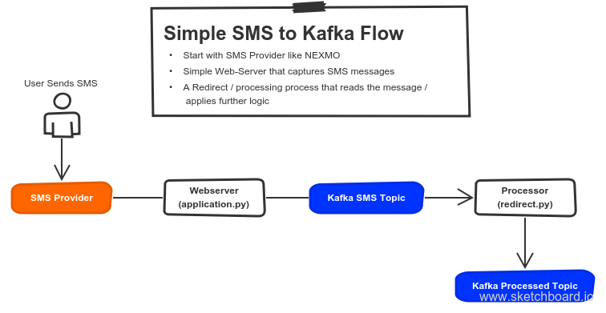

# kafkasms
Simple client to receive messages from SMS(HTTP GET really) and persist onto a Kafka topic.  In this case [nexmo.com](http://nexmo.com) is used as an SMS service which re-directs all SMS messages sent to a number to a URL of your choice.  In this case application.py is such webserver.



##Few parts here:
1. application.py - simple handler which puts the incoming request onto a Kafka topic
2. redirect.py - listens to that topic, parses the message, creates a bunch of new Kafka messages onto another topic. Has threading. Also responds to user via sms_response topic.
3. sms_sender.py - listens to sms_response topic and actually sends those SMSes out.

##Instructions:

```
sudo pip install Flask
sudo pip install kafka-python
```

Run main web-server:

```
python application.py &
```

and then run the re-direct:

```
python redirect.py &
```

and finally, sms responder:

```
python sms_sender.py
```
